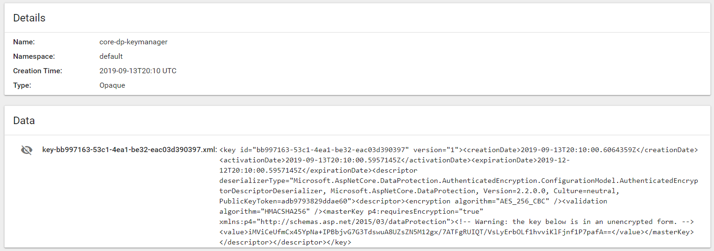
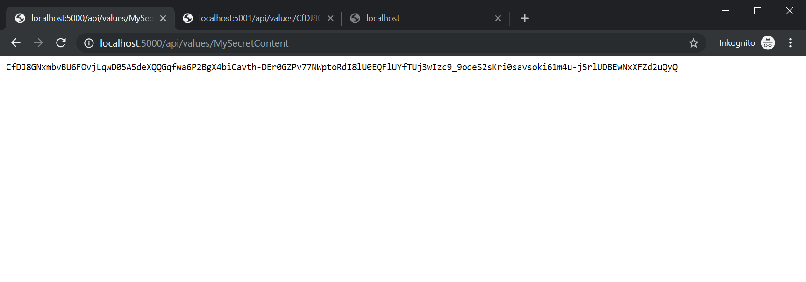
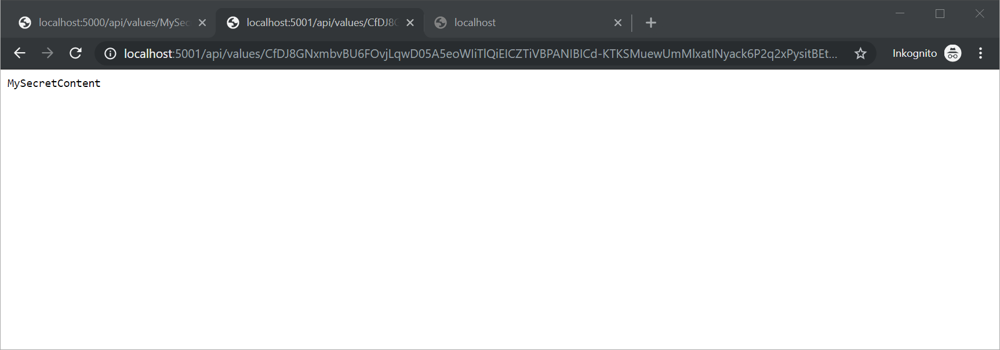
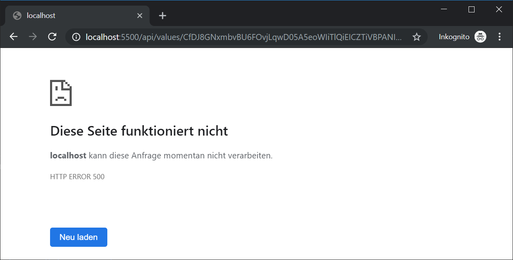

# KubeClient.Extensions.DataProtection

## Example usage for a PersistKeys in a Kubenet Secret 

```csharp
    services.AddDataProtection()
        .PersistKeysToKubeSecret(
            // KubeClientOptions
            KubeClient.KubeClientOptions.FromPodServiceAccount(),
            // Secret Name
            "core-dp-keymanager"  
        )
        // AppName to share Keys...
        .SetApplicationName("shared-app"); 
```

## AutoCreate SecretV1
After the fist AppStart the Extension create a `SecretV1` if the `SecretName` not exsist in the `Namespace`. We need this `AutoCreate` functionality to offer the same possibilities like the FileXmlRepository wich auto-create files in a folder. In our case the `SecretV1` acts as a folder.





## Demo
In `/src` we have 3 different Web-Projects and in `/kubernetes` the deployment files.  
Each of the Web-Projects is a Pod in a StatefulSet with a ServiceAccount. 

In such a distributed enviroment you need to share your Encryption-Key between your Pods.
The demo use `WebEncrypt` Container do Encrypt your String and use the `WebDecypt` Container to decrypt.   

### Setup
To use this with minikube follow this instructions:

*Setup Docker Enviroment*
```bash
$ minikube docker-env            # Setup Enviroment Vars for the Dockerenv
```
*Run the `Makefile` to build the Images inside of Minikube*
```bash
$ make                           # Run Dockerbuild for all Projects
```
*Deploy RBAC & StatefulSets*
```bash
$ cd deployment
$ kubectl apply -f ./rbac.yaml   # Create ServiceAccount with RBAC
$ kubectl apply -f ./deploy.yaml # Create StatefulSets and deploy Pods
```

### WebEncrypt
A Container to Encrypt Strings

```bash
$ kubectl port-forward test-encrypt-0 5000:80 # Portforward the WebEncrypt Container
```
Request the Containter with the Plain Text Content:

http://localhost:5000/api/values/MySecretContent

The Content is now encryped.
>CfDJ8Luw7rO_rLRPlk_N26xWS9_YV2ynZMdQHKM68pDzSJ_GpTqZGdRX8m1UmRKFMmE3XOcZBIP4rTRJxLq0vQwKmW7YT_2SHqAtNof28Vj-MWbE2E251ITfH3ouS-rXkNcmQg



### WebDecypt
Another Container to Decrypt the String

```bash
$ kubectl port-forward test-decrypt-0 5001:80 # Portforward the WebDecypt Container
```
Request the Containter with the Protected Content:

http://localhost:5001/api/values/CfDJ8Luw7rO_rLRPlk_N26xWS9_YV2ynZMdQHKM68pDzSJ_GpTqZGdRX8m1UmRKFMmE3XOcZBIP4rTRJxLq0vQwKmW7YT_2SHqAtNof28Vj-MWbE2E251ITfH3ouS-rXkNcmQg

The Content is now decryped.
> MySecretContent



### WebRef
A Container without the Extension to test a Error.
```bash
$ kubectl port-forward test-ref-0 5500:80 # Portforward the WebRef Container
```

Request the Containter with the Protected Content:

http://localhost:5500/api/values/CfDJ8Luw7rO_rLRPlk_N26xWS9_YV2ynZMdQHKM68pDzSJ_GpTqZGdRX8m1UmRKFMmE3XOcZBIP4rTRJxLq0vQwKmW7YT_2SHqAtNof28Vj-MWbE2E251ITfH3ouS-rXkNcmQg

Crash with Error 500 =>
> System.Security.Cryptography.CryptographicException:   
> The key {bb997163-53c1-4ea1-be32-eac03d390397} was not found in the key ring.


