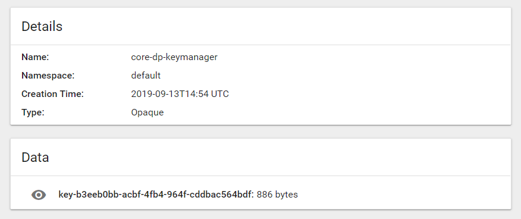

# KubeClient.Extensions.DataProtection

## Example usage for a PersistKeys in a Kubenet Secret 

```csharp
    services.AddDataProtection()
        .PersistKeysToKubeSecret(
            KubeClient.KubeClientOptions.FromPodServiceAccount(), // KubeClientOptions
            "core-dp-keymanager" // Secret Name 
        )
        .SetApplicationName("shared-app"); // AppName to share Keys...
```

## Kubernetes Dashboard




## Demo
In `/src` are have 3 Web-Projects to and in `/kubernetes` the deployment files.  

To use this with minikube follow this instructions:

*Setup Docker Enviroment*
```bash
$ minikube docker-env            # Setup Enviroment Vars for the Dockerenv
```
*Run the `Makefile` to build the Images inside of Minikube*
```bash
$ make                           # Run Dockerbuild for all Projects
```
*Deploy RBAC & StatefulSets*
```bash
$ cd deployment
$ kubectl apply -f ./rbac.yaml   # Create ServiceAccount with RBAC
$ kubectl apply -f ./deploy.yaml # Create StatefulSets and deploy Pods
```

### WebEncrypt
```bash
$ kubectl port-forward test-encrypt-0 5000:80 # Portforward the WebEncrypt Container
```
Request the Containter with the Plain Text Content:

http://localhost:5000/api/values/MySecretContent

The Content is now encryped.
>CfDJ8Luw7rO_rLRPlk_N26xWS9_YV2ynZMdQHKM68pDzSJ_GpTqZGdRX8m1UmRKFMmE3XOcZBIP4rTRJxLq0vQwKmW7YT_2SHqAtNof28Vj-MWbE2E251ITfH3ouS-rXkNcmQg


### WebDecypt
```bash
$ kubectl port-forward test-decrypt-0 5001:80 # Portforward the WebDecypt Container
```
Request the Containter with the Protected Content:

http://localhost:5001/api/values/CfDJ8Luw7rO_rLRPlk_N26xWS9_YV2ynZMdQHKM68pDzSJ_GpTqZGdRX8m1UmRKFMmE3XOcZBIP4rTRJxLq0vQwKmW7YT_2SHqAtNof28Vj-MWbE2E251ITfH3ouS-rXkNcmQg

The Content is now decryped.
> MySecretContent

### WebRef
```bash
$ kubectl port-forward test-ref-0 6000:80 # Portforward the WebRef Container
```

Request the Containter with the Protected Content:

http://localhost:6000/api/values/CfDJ8Luw7rO_rLRPlk_N26xWS9_YV2ynZMdQHKM68pDzSJ_GpTqZGdRX8m1UmRKFMmE3XOcZBIP4rTRJxLq0vQwKmW7YT_2SHqAtNof28Vj-MWbE2E251ITfH3ouS-rXkNcmQg

Crash with Error 500 =>
> System.Security.Cryptography.CryptographicException:   
> The key {b3eeb0bb-acbf-4fb4-964f-cddbac564bdf} was not found in the key ring.

